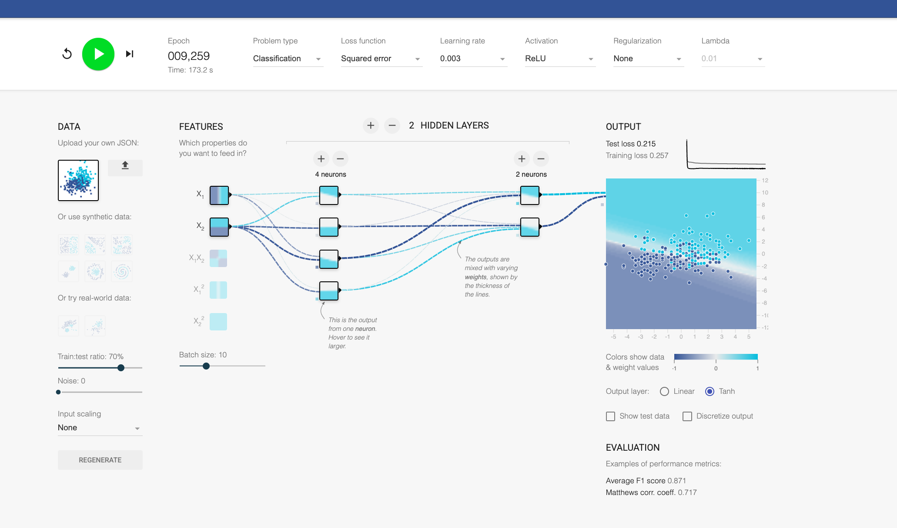

---

## Paso 1: Preprocesamiento de Datos

**Variables seleccionadas:**

| Columna original | Nuevo nombre | Rol |
|---|---|---|
| `edad` | `x` | Feature 1 |
| `colesterol` | `y` | Feature 2 |
| `problema_cardiaco` | `label` | Target (binario) |

**Transformaciones aplicadas:**

1. **Limpieza:** Se eliminaron 4 filas con valores nulos → **298 registros válidos**
2. **Mapeo de etiquetas:** `1 → 1` (positivo), `0 → -1` (negativo)
3. **Estandarización Z-score × 2:** `x_norm = ((x - μ) / σ) × 2`

**Estadísticas post-normalización:**

| Feature | μ original | σ original | Rango normalizado |
|---|---|---|---|
| edad (x) | 54.31 años | 9.08 | [-5.57, +5.00] |
| colesterol (y) | 246.93 mg/dL | 51.69 | [-4.68, +12.27] |

**Distribución del target:** 147 positivos (label=1) · 151 negativos (label=-1)

---

## Paso 2: Configuración en ScienxLab

| Hiperparámetro | Valor |
|---|---|
| Problem type | Classification |
| Loss function | Squared error |
| Activation | ReLU |
| Regularization | None |
| Train : Test ratio | 70% |
| Arquitectura | 2 capas ocultas: [4 neuronas, 2 neuronas] |

---

## Paso 3: Resultados de Experimentos

### Experimento A – Variación del Learning Rate
*Arquitectura fija: 2 capas ocultas [4, 2] neuronas*

| Learning Rate | Train Loss | Test Loss | F1 Score | MCC | Diagnóstico |
|---|---|---|---|---|---|
| **0.003** ⭐ | 0.257 | **0.215** | **0.871** | **0.717** | **Mejor generalización** |
| 0.01 | 0.247 | 0.221 | 0.840 | 0.647 | Bueno |
| 0.03 | **0.214** | 0.247 | 0.848 | 0.669 | Menor train loss, mayor test loss |
| 0.1 | 0.243 | 0.229 | 0.851 | 0.672 | Convergencia rápida |
| 0.3 | 0.267 | 0.220 | 0.866 | 0.711 | Bueno pese al LR alto |

### Capturas de Pantalla por Experimento

**LR = 0.003 ⭐ (Mejor resultado)**



**LR = 0.01**


**LR = 0.03**


**LR = 0.1**


**LR = 0.3**


---

## Paso 4: Mejor Configuración

| Parámetro | Valor |
|---|---|
| **Learning Rate** | **0.003** |
| **Arquitectura** | **2 capas ocultas: [4 neuronas, 2 neuronas]** |
| Activación | ReLU |
| Train Loss | 0.257 |
| **Test Loss** | **0.215** |
| **F1 Score** | **0.871** |
| **Matthews Coeff.** | **0.717** |

### Justificación Teórica

**¿Por qué LR = 0.003 es el ganador?**

Aunque LR=0.003 convergió más lento (requirió ~9,259 épocas), logró el **menor test loss (0.215)**, el **mayor F1 score (0.871)** y el **mayor Matthews Correlation Coefficient (0.717)**. Esto se explica porque un learning rate pequeño permite pasos de gradiente descendente más finos: `w ← w − η·∇L`. Con pasos pequeños, el optimizador no "salta" sobre los mínimos del espacio de pérdida, explorando zonas de mayor precisión. El resultado es un modelo que **generaliza mejor** (test loss más bajo), aunque tarde más épocas en converger.

**Observación sobre LR=0.03:** Aunque tiene el menor training loss (0.214), su test loss es el más alto (0.247), lo que sugiere **leve overfitting** — aprendió bien el training set pero generalizó peor.

**Observación sobre LR=0.3:** Contrario a lo esperado, no divergió. Esto indica que la superficie de pérdida de este problema es relativamente suave, permitiendo que incluso LR altos converjan sin oscilaciones destructivas.

**¿Por qué arquitectura [4, 2]?**

La primera capa oculta (4 neuronas) aprende representaciones no lineales de edad y colesterol. La segunda capa (2 neuronas) comprime esa representación para separar las clases. Esta arquitectura balancea capacidad de aprendizaje y riesgo de overfitting para un dataset de 298 muestras.

**¿Por qué ReLU?**

ReLU `f(x) = max(0, x)` evita el problema del gradiente desvaneciente de sigmoide/tanh en capas intermedias. Activa selectivamente neuronas relevantes y genera fronteras de decisión nítidas.

---

## Código de la Red Neuronal – Mejor Configuración (LR = 0.003)

```python
import math
def forward(X1, X2):
    """
    Red Neuronal entrenada con LR=0.003, arquitectura [4,2], ReLU.
    X1 = edad estandarizada (Z-score x2)
    X2 = colesterol estandarizado (Z-score x2)
    Retorna: valor entre -1 y 1 (>0 = problema cardíaco, <0 = sin problema)
    """
    # Capa oculta 1: 4 neuronas (activación ReLU)
    a1 = max(0, -0.19 + (0.36 * X1) + (0.62 * X2))
    a2 = max(0, -0.055 + (0.0083 * X1) + (-0.82 * X2))
    a3 = max(0, -0.58 + (-0.51 * X1) + (-0.95 * X2))
    a4 = max(0, 0.37 + (0.059 * X1) + (-0.71 * X2))
    # Capa oculta 2: 2 neuronas (activación ReLU)
    a5 = max(0, 0.54 + (0.51 * a1) + (-0.15 * a2) + (-1.1 * a3) + (0.077 * a4))
    a6 = max(0, 0.13 + (-0.18 * a1) + (-0.91 * a2) + (0.49 * a3) + (0.79 * a4))
    # Capa de salida: 1 neurona (activación Tanh)
    a7 = math.tanh(-0.22 + (1.3 * a5) + (-1.1 * a6))
    return a7  # > 0 → clase 1 (problema cardíaco) | < 0 → clase -1 (sin problema)
```

### Códigos de todos los experimentos

<details>
<summary>LR = 0.01</summary>

```python
import math
def forward(X1, X2):
    a1 = max(0, -0.53 + (-0.45 * X1) + (-0.98 * X2))
    a2 = max(0, 1.1 + (-0.28 * X1) + (0.64 * X2))
    a3 = max(0, 1.3 + (0.56 * X1) + (1.9 * X2))
    a4 = max(0, 0.96 + (0.78 * X1) + (1.6 * X2))
    a5 = max(0, 0.060 + (0.50 * a1) + (0.69 * a2) + (-0.47 * a3) + (0.44 * a4))
    a6 = max(0, 0.87 + (-0.61 * a1) + (-0.71 * a2) + (1.6 * a3) + (-1.3 * a4))
    a7 = math.tanh(-0.57 + (-0.60 * a5) + (1.4 * a6))
    return a7
```
</details>

<details>
<summary>LR = 0.03</summary>

```python
import math
def forward(X1, X2):
    a1 = max(0, -1.6 + (-0.12 * X1) + (-2.3 * X2))
    a2 = max(0, -2.1 + (-1.6 * X1) + (-3.2 * X2))
    a3 = max(0, -2.8 + (1.3 * X1) + (-0.71 * X2))
    a4 = max(0, 1.0 + (1.5 * X1) + (4.8 * X2))
    a5 = max(0, 1.0 + (1.8 * a1) + (-3.6 * a2) + (0.080 * a3) + (0.087 * a4))
    a6 = max(0, 0.62 + (-0.56 * a1) + (0.34 * a2) + (1.6 * a3) + (-3.7 * a4))
    a7 = math.tanh(-0.39 + (0.71 * a5) + (-1.7 * a6))
    return a7
```
</details>

<details>
<summary>LR = 0.1</summary>

```python
import math
def forward(X1, X2):
    a1 = max(0, -3.9 + (-1.5 * X1) + (-4.5 * X2))
    a2 = max(0, -1.5 + (-3.1 * X1) + (-2.7 * X2))
    a3 = max(0, 1.8 + (-1.1 * X1) + (0.82 * X2))
    a4 = max(0, 1.5 + (-0.54 * X1) + (3.3 * X2))
    a5 = max(0, 0.44 + (-2.7 * a1) + (3.9 * a2) + (0.72 * a3) + (-5.6 * a4))
    a6 = max(0, 0.91 + (1.0 * a1) + (-1.0 * a2) + (1.1 * a3) + (-0.66 * a4))
    a7 = math.tanh(1.1 + (-1.5 * a5) + (-0.47 * a6))
    return a7
```
</details>

<details>
<summary>LR = 0.3</summary>

```python
import math
def forward(X1, X2):
    a1 = max(0, 0.55 + (-0.051 * X1) + (-2.2 * X2))
    a2 = max(0, 0.18 + (-0.48 * X1) + (-0.24 * X2))
    a3 = max(0, 0.36 + (0.038 * X1) + (-0.68 * X2))
    a4 = max(0, 0.30 + (-0.80 * X1) + (-0.41 * X2))
    a5 = max(0, 1.3 + (-2.3 * a1) + (0.14 * a2) + (-0.78 * a3) + (0.25 * a4))
    a6 = max(0, -0.92 + (0.45 * a1) + (0.67 * a2) + (0.0098 * a3) + (1.1 * a4))
    a7 = math.tanh(0.12 + (0.72 * a5) + (-0.51 * a6))
    return a7
```
</details>

---

## Análisis Train vs Test Loss

| Indicador | Qué significa |
|---|---|
| Test loss < Train loss | El modelo generaliza bien (split favorable) |
| Test loss ≈ Train loss | Balance ideal |
| Test loss >> Train loss | Overfitting — memoriza training set |

En todos los experimentos el gap fue menor a 0.05, lo que indica **buena generalización** para todos los LR probados con esta arquitectura.

---

## Cómo ejecutar el preprocesamiento

```bash
pip install pandas numpy
cd src
python preprocesamiento.py
```
